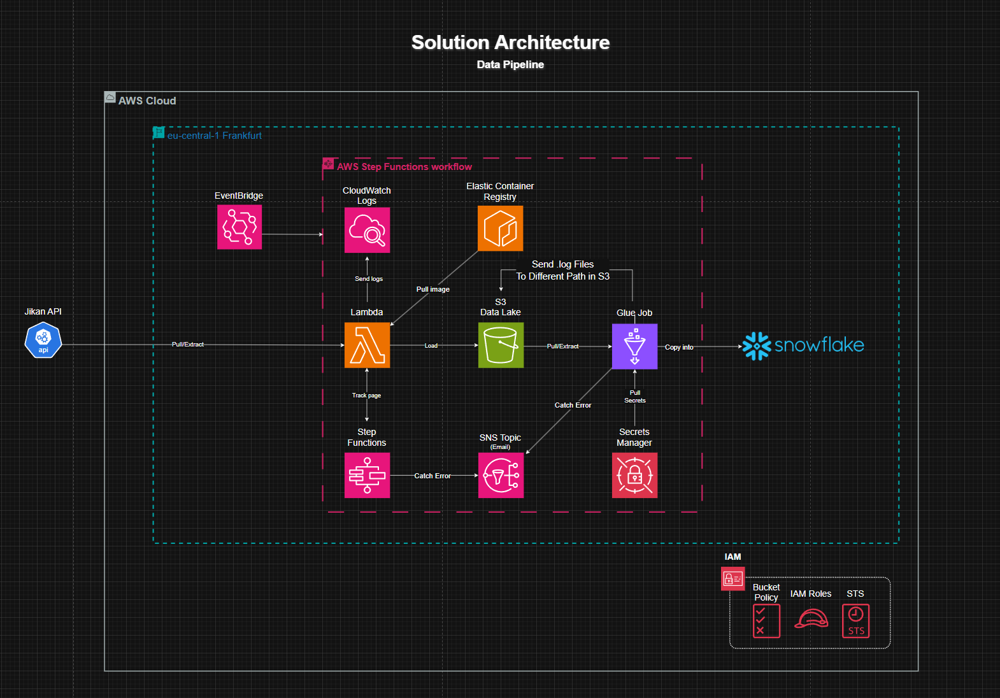
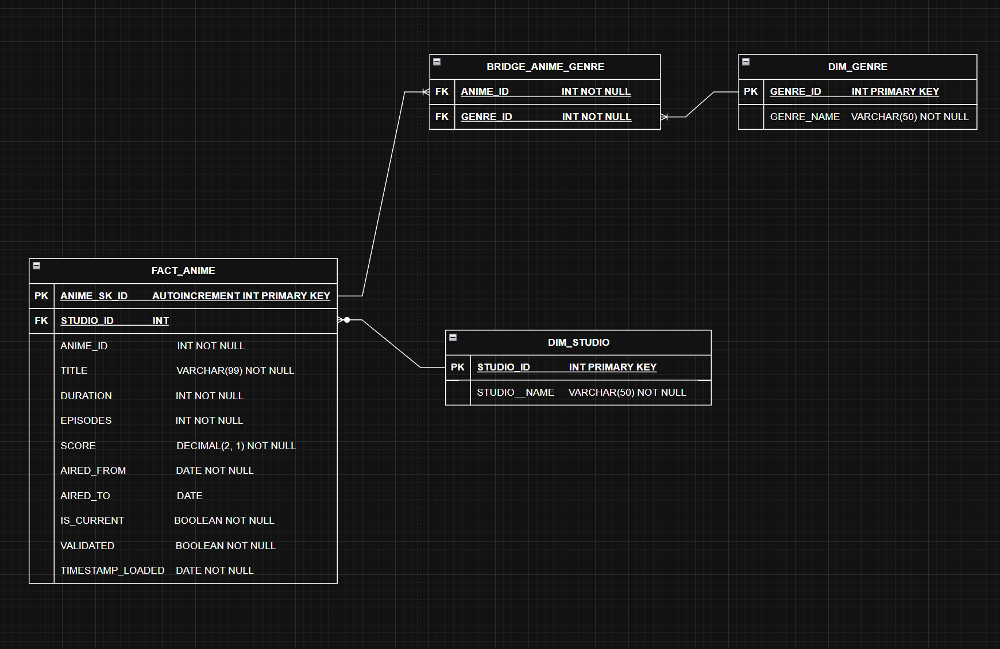
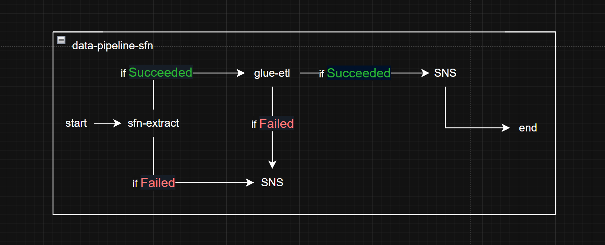

# anime_analytics_part_2
this project is concluded of ETL from S3 to AWS Glue and loaded into Snowflake


```bash
/etl-pipeline-repo/
├── .github/workflows/               # CI/CD automation
├──          ├── deploy.yaml
├──          └── validate.yaml
├── etl_venv/ 
├── application/                     # ETL logic
│     ├── etl/
│     │    ├── check_attribute.py
│     │    ├── dataframe_cleaning.py
│     │    ├── etl_script.py
│     │    ├── extract_data_s3.py
│     │    ├── get_secrets.py
│     │    ├── log_to_s3.py
│     │    ├── logger_setup.py
│     │    ├── snowflake_data_load.py
│     │    └── sql_composite_prep.py
│     │    
│     ├── migrations/
│     │    ├── get_secrets.py
│     │    ├── migration_db.py
│     │    ├── README.md
│     │    └── sql/
│     │         ├── 00_create_data_warehouse.sql
│     │         ├── 01_create_database.sql
│     │         ├── 02_use_database.sql
│     │         ├── 03_create_schema.sql
│     │         ├── 04_use_schema.sql
│     │         ├── 05_create_dim_studio.sql
│     │         ├── 06_create_dim_genre.sql
│     │         ├── 07_create_fact_aniem.sql
│     │         └── 08_create_bridge_anime_genre.sql
│     │
│     └──tests/                      # Data quality or unit tests
│          ├── mock_dataframe.py     # it includes fixtures
│          ├── test_check_attribute.py
│          └── test_dataframe_cleaning.py
│          
├── infrastructure/                  # AWS Cloud native Infrastructure
│        ├── config.tf
│        ├── variable.tf
│        ├── glue/
│        │    ├── data_lake_s3.tf
│        │    ├── glue_job.tf
│        │    ├── outputs.tf
│        │    └── variable.tf
│        │
│        ├── monitoring/
│        │    ├── cw_logs.tf
│        │    ├── outputs.tf 
│        │    └── sns.tf
│        │
│        ├── orchestration/
│        │    ├── eventbridge.tf
│        │    ├── outputs.tf
│        │    ├── step_functions.tf
│        │    └── variable.tf
│        │
│        └── security/
│             ├── eventbridge_permissions.tf
│             ├── glue_permissions.tf
│             ├── outputs.tf
│             ├── secrets_manager.tf
│             ├── step_func_permissions.tf
│             └── variable.tf
│  
├── requirements.txt
├── .gitignore
├── LICENSE
└── README.md
```

### Table of Contents
1. [Start-up Package](#start-up-package)
2. [Database Migration Script](#database-migration-script)
3. [ETL software](#etl-software)
4. [Unittests](#unittests)
4. [Infrastructure](#infrastructure)

</br>
</br>
</br>
</br>


## Start-up Package 
### Good practice when working on multiple python projects </br></br>
when starting the project make sure to create a virtual envrironment in the root of the project directory as followed:

- step 1:</br>
**check your current directory**
```bash
pwd
```


make sure to be in the root ending with `**/anime_analytics_part_2`
</br></br>

- step 2: </br>
**create the python environment:**
```bash
python3 -m venv etl_venv
```
</br>

- step 3: </br>
**enter the virtual environment with this command**
</br>

`linux`
```bash
source etl_venv/bin/activate
```
</br>

`windows`
```powershell
.\etl_venv\Scripts\Activate
```
#### these steps should activate you into a virtual environment where if you install any dependencies or extras you merely place them into this environment, outside it, you cant access them

- step 4: </br>
**deactivate/escape environment**
```bash
deactivate
```

</br>
</br>
</br>

## Database Migration Script
#### Read the README in `./application/migrations/` directory


</br>
</br>
</br>

## ETL software

### Overview
ETL pipeline that processes anime data from S3 to Snowflake with data quality checks and incremental loading.

### Key Components

#### Core Modules
- **Extract**: `extract_data_s3.py` - Pulls CSV data from S3
- **Transform**: 
  - `dataframe_cleaning.py` - Cleans and structures data
  - `check_attribute.py` - Validates field lengths
- **Load**: `snowflake_data_load.py` - Bulk loads to Snowflake
- **Orchestration**: `etl_script.py` - Main workflow controller

#### Support Utilities
- `sql_composite_prep.py` - DB operations & deduplication
- `logger_setup.py` - Unified logging config
- `get_secrets.py` - Secure credential management
- `log_to_s3.py` - Log archiving

### Workflow
1. Extract raw CSV from S3
2. Transform data:
   - Clean nulls/duplicates
   - Create dimension tables
   - Generate bridge tables
3. Load to Snowflake with:
   - Composite key deduplication
   - Surrogate key generation
   - Incremental updates

### Features
- ✅ Secure credential handling via AWS Secrets Manager
- ✅ Comprehensive error logging
- ✅ Automated log archiving to S3
- ✅ Data quality validation
- ✅ Incremental loading

### Tech Stack
- **Language**: Python 3
- **Storage**: AWS S3
- **Warehouse**: Snowflake
- **Libraries**: pandas, boto3, snowflake-connector

### Usage
Run `python etl_script.py` to execute the full pipeline.

</br>
</br>
</br>

## Unittests

### Overview
Unit tests for the Anime Analytics ETL pipeline using pytest, with mock data fixtures.

### Test Structure

#### Mock Data Fixtures (`mock_dataframes.py`)
- `raw_mock_df`: Initial raw data for type conversion tests
- `clean_mock_df`: Contains edge cases for attribute validation
- `managed_mock_df`: Processed data with nulls for transformation tests

#### Test Modules

##### `test_check_attribute.py`
- Validates string field length constraints
- Tests:
  - Studio names ≤ 50 chars
  - Titles ≤ 99 chars
  - Long strings are filtered out

##### `test_dataframe_cleaning.py`
- Tests all dataframe transformation functions:
  - `test_data_type_converter`: Verifies numeric type conversion
  - `test_clean_genre_name_and_id`: Checks genre table creation
  - `test_bridge_anime_and_genre`: Validates bridge table logic
  - `test_clean_null_and_duplicates`: Ensures data quality
  - `test_clean_dim_studio_df`: Verifies studio dimension processing

### Key Features
✅ Isolated test cases with dedicated fixtures  
✅ Comprehensive data validation checks  
✅ Edge case testing (nulls, long strings)  
✅ Type safety verification  
✅ Deduplication logic testing  

### Running Tests
```bash
pytest -v -s 
```
*you must be inside `./tests` directory*


</br>
</br>
</br>


## Infrastructure

### ./glue
| File               | Description |
|--------------------|-------------|
| `outputs.tf`       | Exports the AWS Glue job's ARN and name as Terraform outputs |
| `data_lake_s3.tf`  | References an existing S3 bucket (data lake) using the bucket name variable |
| `variable.tf`      | Declares sensitive variables for the S3 bucket name and Glue IAM role ARN |
| `glue_job.tf`      | Defines the AWS Glue ETL job configuration including script location, Python dependencies, and runtime settings |

### ./monitoring
| File               | Description |
|--------------------|-------------|
| `outputs.tf`       | Exports CloudWatch Log Group name and SNS Topic ARN as Terraform outputs |
| `cw_logs.tf`       | Creates a CloudWatch Log Group for storing AWS Glue job logs |
| `sns.tf`           | Configures an SNS Topic for notifications with email subscription | 

### ./orchestration
| File                          | Description |
|-------------------------------|-------------|
| `variable.tf`                 | Declares variables for Step Functions, Glue, SNS, and EventBridge IAM roles |
| `eventbridge.tf`              | Creates EventBridge rule for monthly Step Functions trigger |
| `step_functions.tf`           | Defines Step Function state machine for pipeline orchestration |
| `outputs.tf`                  | Exports Step Function ARN as output |

### ./security
| File                          | Description |
|-------------------------------|-------------|
| `eventbridge_permissions.tf`  | Creates IAM role and policy for EventBridge to trigger Step Functions |
| `glue_permissions.tf`         | Defines IAM role and policies for Glue with S3, CloudWatch, and Secrets Manager access |
| `outputs.tf`                  | Exports IAM role ARNs (Glue, Step Functions, EventBridge) and Step Functions workflow ARN |
| `secrets_manager.tf`          | Creates Secrets Manager secret and stores Snowflake credentials |
| `step_func_permissions.tf`    | Configures IAM role and policies for Step Functions to access Glue, SNS, and EventBridge |
| `variable.tf`                 | Declares sensitive variables for AWS resources, credentials, and configurations |

</br>
</br>
</br>


## Images

#### Solution Architecture


</br>
</br>

#### Data model (physical)



</br>
</br>
</br>


#### Data Orchestration Workflow
